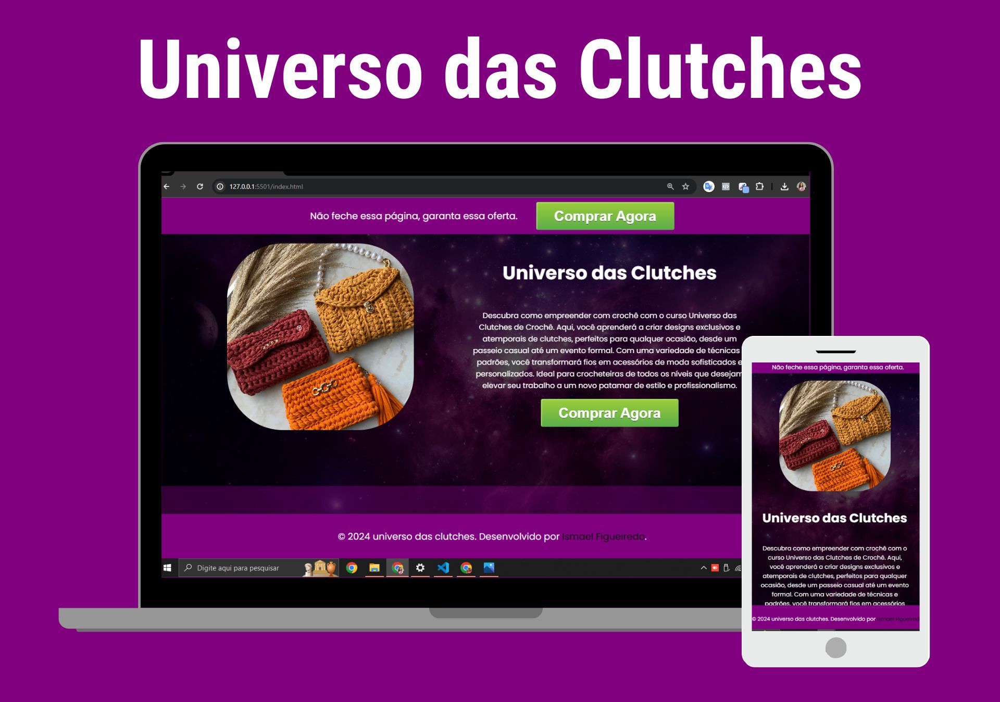

# Universo das Clutches

## Descrição do Projeto
"Universo das Clutches" é uma página de vendas que oferece um curso sobre crochê, focado na criação de clutches. Destinado a entusiastas de crochê de todos os níveis, o site também funciona como modelo para usuários que desejam criar suas próprias páginas de vendas..

## [Visualizar o Projeto](https://artefioscrochet.com.br/universodasclutches/)

## Tecnologias Utilizadas
- HTML
- CSS
- JavaScript

## Funcionalidades
- Visualização de modelos de clutches
- Informações detalhadas sobre cada modelo
- Sistema de compra integrado (Hotmart)

## Como Usar
1. Acesse o site pelo arquivo `index.html` usando qualquer navegador moderno.
2. Explore os diferentes modelos de clutches disponíveis.
3. Utilize o botão "Comprar Agora" para adquirir o curso.

## Licença
Este projeto está sob a Licença MIT.

## Autor
- 👨‍🦱 Ismael Figueiredo
- 👔 [LinkedIn](https://www.linkedin.com)
- ✉ [Contato@ismaelfigueiredo.com](mailto:Contato@ismaelfigueiredo.com)

